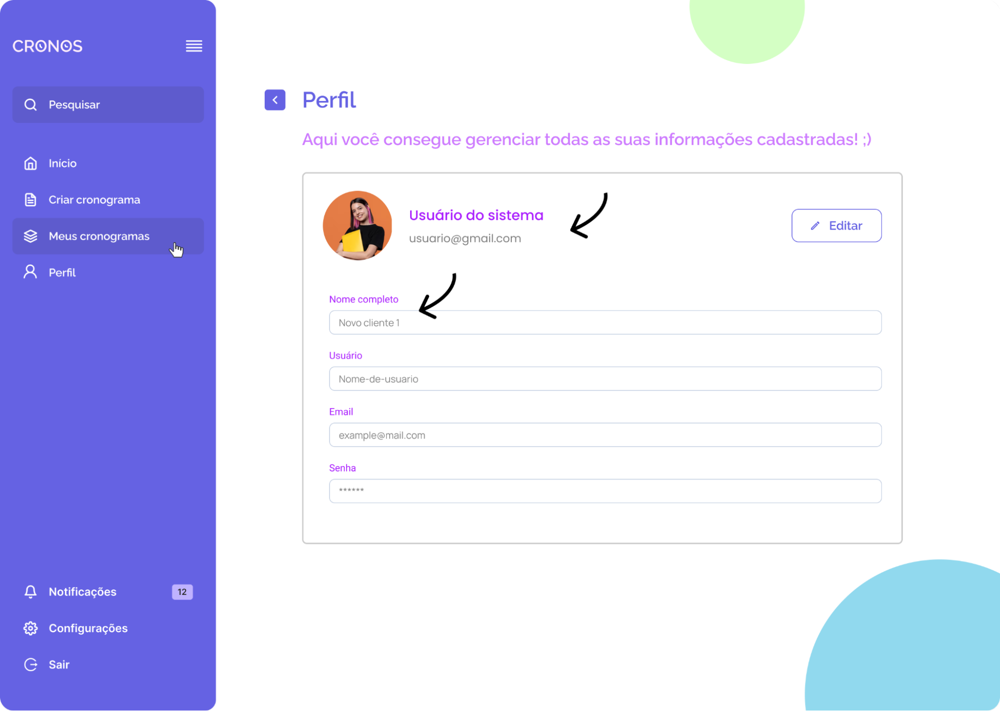
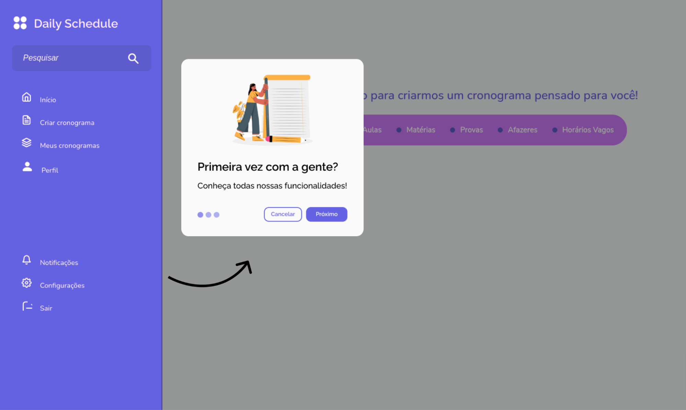
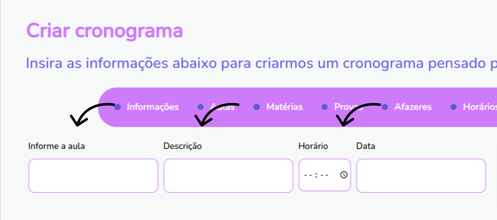
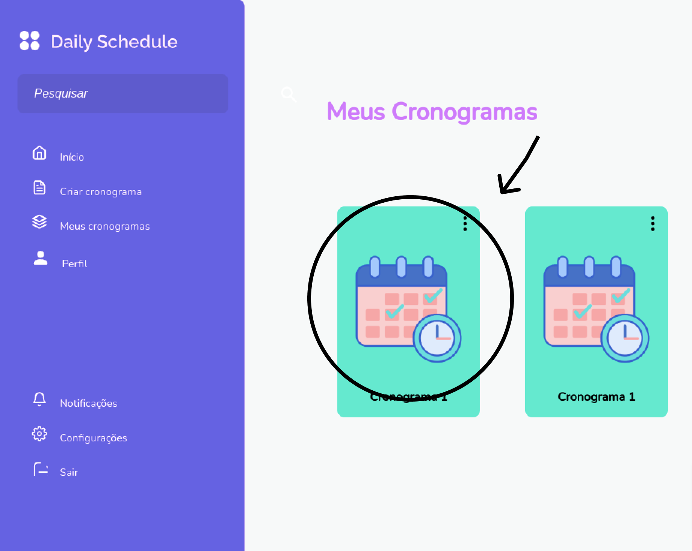

# Relatório completo da avaliação sistemática no sistema Daily Schedule

O relatório apresenta as diretrizes contempladas e violadas identificadas durante a avaliação sistemática do sistema Daily Schedule. As tabelas documentam os problemas encontrados, fornecendo as deficiências e áreas de melhoria. Cada tabela inclui a descrição dos problemas, sugestões de melhoria e propostas de redesign.

## Sumário
1. [Aspectos Funcionais](#aspectos-funcionais)
2. [Comunicação](#comunicação)
3. [Formatação](#formatação)
4. [Navegação](#navegação)
5. [Particularidades do Usuário](#particularidades-do-usuário)
6. [Particularidades do Dispositivo](#particularidades-do-dispositivo)

## Aspectos Funcionais
<strong>Tabela 1 </strong> – Relatório de análise de aspectos funcionais do sistema Daily Schedule
<table>
  <tr>
    <td colspan="6">
      
<strong>ASPECTOS FUNCIONAIS (AF)</strong>

    </td>
  </tr>

  <tr>
    <td colspan="2">
AF1 - Funcionalidade
</td>
    <td colspan="2">
Contemplada
</td>
    <td colspan="2">
Todas as telas
</td>
  </tr>
  <tr>
    <td colspan="2">
AF2 - Flexibilidade de ação
</td>
    <td colspan="2">
Contemplada
</td>
    <td colspan="2">
Todas as telas
</td>
  </tr>
  <tr>
    <td colspan="2">
AF3 - Edição de ações
</td>
    <td colspan="2">
Necessário rever
</td>
    <td colspan="2">
Na página de perfil do usuário
</td>
  </tr>
  <tr>
    <td colspan="6">
      

    </td>
  </tr>
  <tr>
    <td colspan="6">
      
<strong>Sugestão de melhoria:</strong> Criar um botão onde o usuário consiga editar suas informações cadastradas.

    </td>
  </tr>
  <tr>
    <td colspan="6">
      
<strong>Proposta de redesign:</strong>

      

    </td>
  </tr>

  <tr>
    <td colspan="2">
AF4 - Recuperação de dados perdidos
</td>
    <td colspan="2">
Contemplada
</td>
    <td colspan="2">
Todas as telas
</td>
  </tr>
  <tr>
    <td colspan="2">
AF5 - Autopreenchimento
</td>
    <td colspan="2">
Contemplada
</td>
    <td colspan="2">
Todas as telas
</td>
  </tr>
  <tr>
    <td colspan="2">
AF6 - Sugestão de preenchimento
</td>
    <td colspan="2">
Necessário rever
</td>
    <td colspan="2">
No barra de pesquisa livre
</td>
  </tr>
  <tr>
    <td colspan="6">
      

    </td>
  </tr>
  <tr>
    <td colspan="6">
      
<strong>Sugestão de melhoria:</strong> Ter uma listagem quando clicar na barra de pesquisa exibindo sugestões a partir da incidência das buscas ou intenção de anúncios.

    </td>
  </tr>
  <tr>
    <td colspan="6">
      
<strong>Proposta de redesign:</strong> Redesign previsto para ações futuras.

    </td>
  </tr>

  <tr>
    <td colspan="2">
AF7 - Escrita Inteligente
</td>
    <td colspan="2">
Necessário rever
</td>
    <td colspan="2">
Nos inputs do sistema
</td>
  </tr>
  <tr>
    <td colspan="6">
      

    </td>
  </tr>
  <tr>
    <td colspan="6">
      
<strong>Sugestão de melhoria:</strong> Após pedir autorização para o usuário, colocar uma sugestão de escrita a partir de padrões nos campos.

    </td>
  </tr>
  <tr>
    <td colspan="6">
      
<strong>Proposta de redesign:</strong> Redesign previsto para ações futuras.

    </td>
  </tr>

  <tr>
    <td colspan="2">
AF8 - Cancelamento de ações
</td>
    <td colspan="2">
Necessário rever
</td>
    <td colspan="2">
Na criação de cronogramas
</td>
  </tr>
  <tr>
    <td colspan="6">
      

    </td>
  </tr>
  <tr>
    <td colspan="6">
      
<strong>Sugestão de melhoria:</strong> Criar um botão de cancelar caso o usuário não queira mais criar o cronograma.

    </td>
  </tr>
  <tr>
    <td colspan="6">
      
<strong>Proposta de redesign:</strong>

      

    </td>
  </tr>

  <tr>
    <td colspan="2">
AF9 - Prevenção de erros
</td>
    <td colspan="2">
Necessário rever
</td>
    <td colspan="2">
Na exclusão de cronogramas
</td>
  </tr>
  <tr>
    <td colspan="6">
      

    </td>
  </tr>
  <tr>
    <td colspan="6">
      
<strong>Descrição do problema e sugestão de melhoria:</strong> Ao clicar no ícone da lixeira, ele imediatamente deleta o cronograma, sem solicitar ao usuário a confirmação da ação. Então, é necessário que tenha uma caixa de confirmação de ação.

    </td>
  </tr>
  <tr>
    <td colspan="6">
      
<strong>Proposta de redesign:</strong>

      

    </td>
  </tr>

  <tr>
    <td colspan="2">
AF10 – Restrições
</td>
    <td colspan="2">
Necessário rever
</td>
    <td colspan="2">
Na criação de cronograma
</td>
  </tr>
  <tr>
    <td colspan="6">
      

    </td>
  </tr>
  <tr>
    <td colspan="6">
      
<strong>Descrição do problema e sugestão de melhoria:</strong> No momento não existe uma tratativa caso o usuário tente criar um cronograma com data antiga. É preciso restringir a criação caso o usuário adicione datas antecessores que ele está no momento.

    </td>
  </tr>
  <tr>
    <td colspan="6">
      
<strong>Proposta de redesign:</strong> Redesign previsto para ações futuras.

    </td>
  </tr>

  <tr>
    <td colspan="2">
AF11 – Digitação otimizada
</td>
    <td colspan="2">
Necessário rever
</td>
    <td colspan="2">
No processo de entrada de dados
</td>
  </tr>
  <tr>
    <td colspan="6">
      

    </td>
  </tr>
  <tr>
    <td colspan="6">
      
<strong>Sugestão de melhoria:</strong> Implementar uma função de autocomplete para melhorar a eficiência da digitação.

    </td>
  </tr>
  <tr>
    <td colspan="6">
      
<strong>Proposta de redesign:</strong>

      

    </td>
  </tr>
</table>

***
## Comunicação
<strong>Tabela 2 </strong> – Relatório de análise de comunicação do sistema Daily Schedule

<table>
    <tr>
        <td colspan="6" rowspan="1">
            
<strong>COMUNICAÇÃO (CO)</strong>

        </td>
    </tr>
    <tr>
        <td colspan="2" rowspan="1">
            
CO1 - Linguagem de comunicação apropriada

        </td>
        <td colspan="2" rowspan="1">
            
Necessário rever

        </td>
        <td colspan="2" rowspan="1">
            
Todas as telas

        </td>
    </tr>
    <tr>
        <td colspan="6" rowspan="1">
            

        </td>
    </tr>
    <tr>
        <td colspan="6" rowspan="1">
            
<strong>Descrição do problema e sugestão de melhoria:</strong>

            
A marca não tem uma linguagem de comunicação boa, visto que é genérica. Então, é necessário adotar uma linguagem informal para se relacionar melhor com seu público-alvo.

        </td>
    </tr>
    <tr>
        <td colspan="6" rowspan="1">
            
<strong>Proposta de redesign:</strong>

            
Redesign previsto para ações futuras.

        </td>
    </tr>
    <tr>
        <td colspan="2" rowspan="1">
            
CO2 - Feedback adequado

        </td>
        <td colspan="2" rowspan="1">
            
Necessário rever

        </td>
        <td colspan="2" rowspan="1">
            
Na criação do cronograma

        </td>
    </tr>
    <tr>
        <td colspan="6" rowspan="1">
            

        </td>
    </tr>
    <tr>
        <td colspan="6" rowspan="1">
            
<strong>Descrição do problema e sugestão de melhoria:</strong>

            
Por não existir nenhuma sinalização de que o usuário criou o cronograma com sucesso, deve ser necessário criar um sinalizador retornando a ação do usuário.

        </td>
    </tr>
    <tr>
        <td colspan="6" rowspan="1">
            
<strong>Proposta de redesign:</strong>

            
Redesign previsto para ações futuras.

        </td>
    </tr>
    <tr>
        <td colspan="2" rowspan="1">
            
CO3 – Affordance

        </td>
        <td colspan="2" rowspan="1">
            
Necessário rever

        </td>
        <td colspan="2" rowspan="1">
            
Na criação do cronograma

        </td>
    </tr>
    <tr>
        <td colspan="6" rowspan="1">
            

        </td>
    </tr>
    <tr>
        <td colspan="6" rowspan="1">
            
<strong>Descrição do problema e sugestão de melhoria:</strong>

            
Por não possuir nenhuma especificação ou exemplificação nos campos, faz-se necessário colocar um <strong>placeholder</strong> exemplificando a finalidade dos campos.

        </td>
    </tr>
    <tr>
        <td colspan="6" rowspan="1">
            
<strong>Proposta de redesign:</strong>

            
Redesign previsto para ações futuras.

        </td>
    </tr>
    <tr>
        <td colspan="2" rowspan="1">
            
CO4 – Metáfora

        </td>
        <td colspan="2" rowspan="1">
            
Necessário rever

        </td>
        <td colspan="2" rowspan="1">
            
No menu interno do sistema

        </td>
    </tr>
    <tr>
        <td colspan="6" rowspan="1">
            

        </td>
    </tr>
    <tr>
        <td colspan="6" rowspan="1">
            
<strong>Descrição do problema e sugestão de melhoria:</strong>

            
O ícone de sair não se aplica à finalidade da ação, então é necessário colocar um que seja apropriado para representá-lo.

        </td>
    </tr>
    <tr>
        <td colspan="6" rowspan="1">
            
<strong>Proposta de redesign:</strong>

            
Redesign previsto para ações futuras.

        </td>
    </tr>
    <tr>
        <td colspan="2" rowspan="1">
            
CO5 – Confiabilidade

        </td>
        <td colspan="2" rowspan="1">
            
Contemplada

        </td>
        <td colspan="2" rowspan="1">
            
Todas as telas

        </td>
    </tr>
    <tr>
        <td colspan="2" rowspan="1">
            
CO6 – Adequação ao contexto

        </td>
        <td colspan="2" rowspan="1">
            
Contemplada

        </td>
        <td colspan="2" rowspan="1">
            
Todas as telas

        </td>
    </tr>
    <tr>
        <td colspan="2" rowspan="1">
            
CO7 – Adequação na coleta de dados

        </td>
        <td colspan="2" rowspan="1">
            
Contemplada

        </td>
        <td colspan="2" rowspan="1">
            
Todas as telas

        </td>
    </tr>
    <tr>
        <td colspan="2" rowspan="1">
            
CO8 – Ajuda

        </td>
        <td colspan="2" rowspan="1">
            
Necessário rever

        </td>
        <td colspan="2" rowspan="1">
            
Todas as telas

        </td>
    </tr>
    <tr>
        <td colspan="6" rowspan="1">
            
<strong>Descrição do problema e sugestão de melhoria:</strong>

            
Por não existir uma tela de ajuda para os usuários, é necessário criar uma página onde responda as dúvidas que os usuários possam ter sobre as funcionalidades.

        </td>
    </tr>
    <tr>
        <td colspan="6" rowspan="1">
            
<strong>Proposta de redesign:</strong>

            
Redesign previsto para ações futuras.

        </td>
    </tr>
</table>

***

## Formatação
<strong>Tabela 3 </strong> – Relatório de análise de formatação do sistema Daily Schedule

<table>
  <tr>
    <td colspan="6" rowspan="1">
      
<strong>FORMATAÇÃO (FM)</strong>

    </td>
  </tr>
  <tr>
    <td colspan="2" rowspan="1">
      
FM1 – Visibilidade

    </td>
    <td colspan="2" rowspan="1">
      
Necessário rever

    </td>
    <td colspan="2" rowspan="1">
      
Na criação do cronograma e listagem de cronogramas

    </td>
  </tr>
  <tr>
    <td colspan="6" rowspan="1">
      
    </td>
  </tr>
  <tr>
    <td colspan="6" rowspan="1">
      
<strong>Descrição do problema e sugestão de melhoria:</strong>

      
Por não exibir nada dentre as opções que existem para criar cronograma, deve ser necessário exibir a primeira opção “Informações” para o usuário.

    </td>
  </tr>
  <tr>
    <td colspan="6" rowspan="1">
      
<strong>Proposta de redesign:</strong>

      
Redesign previsto para ações futuras.

    </td>
  </tr>
  <tr>
    <td colspan="2" rowspan="1">
      
FM2 – Hierarquia da informação

    </td>
    <td colspan="2" rowspan="1">
      
Necessário rever

    </td>
    <td colspan="2" rowspan="1">
      
Perfil do usuário

    </td>
  </tr>
  <tr>
    <td colspan="6" rowspan="1">
      
    </td>
  </tr>
  <tr>
    <td colspan="6" rowspan="1">
      
<strong>Descrição do problema e sugestão de melhoria:</strong>

      
Devido a falta de priorização de informações do usuário, tem que definir aquelas de maior importância, como nome e email, e abaixo as demais.

    </td>
  </tr>
  <tr>
    <td colspan="6" rowspan="1">
      
<strong>Proposta de redesign:</strong>

      
    </td>
  </tr>
  <tr>
    <td colspan="2" rowspan="1">
      
FM3 - Consistência externa

    </td>
    <td colspan="2" rowspan="1">
      
Necessário rever

    </td>
    <td colspan="2" rowspan="1">
      
No perfil do usuário

    </td>
  </tr>
  <tr>
    <td colspan="6" rowspan="1">
      
    </td>
  </tr>
  <tr>
    <td colspan="6" rowspan="1">
      
<strong>Descrição do problema e sugestão de melhoria:</strong>

      
Complementando a sugestão de melhoria da FM2 e FM7, a organização das informações deve estar de acordo com os padrões já existentes de perfil do usuário em outros aplicativos, como a imagem de perfil posicionada alinhadamente com os elementos e preenchimento de tela, destacando o nome e abaixo as outras informações, além de ação de editar.

    </td>
  </tr>
  <tr>
    <td colspan="6" rowspan="1">
      
<strong>Proposta de redesign:</strong>

      
    </td>
  </tr>
  <tr>
    <td colspan="2" rowspan="1">
      
FM4 - Consistência interna

    </td>
    <td colspan="2" rowspan="1">
      
Necessário rever

    </td>
    <td colspan="2" rowspan="1">
      
Perfil do usuário e meus cronogramas

    </td>
  </tr>
  <tr>
    <td colspan="6" rowspan="1">
      
      
    </td>
  </tr>
  <tr>
    <td colspan="6" rowspan="1">
      
<strong>Descrição do problema e sugestão de melhoria:</strong>

      
Como as telas internas da interface estão padronizadas na alinhadas à esquerda, com título e subtítulo apresentando a tela selecionada, deve replicar esse padrão nas telas citadas.

    </td>
  </tr>
  <tr>
    <td colspan="6" rowspan="1">
      
<strong>Proposta de redesign:</strong>

      
      
    </td>
  </tr>
  <tr>
    <td colspan="2" rowspan="1">
      
FM5 - Tipografia adequada

    </td>
    <td colspan="2" rowspan="1">
      
Contemplada

    </td>
    <td colspan="2" rowspan="1">
      
Todas as telas

    </td>
  </tr>
  <tr>
    <td colspan="2" rowspan="1">
      
FM6 – Proximidade

    </td>
    <td colspan="2" rowspan="1">
      
Contemplada

    </td>
    <td colspan="2" rowspan="1">
      
Todas as telas

    </td>
  </tr>
  <tr>
    <td colspan="2" rowspan="1">
      
FM7 – Alinhamento

    </td>
    <td colspan="2" rowspan="1">
      
Necessário rever

    </td>
    <td colspan="2" rowspan="1">
      
Perfil do usuário

    </td>
  </tr>
  <tr>
    <td colspan="6" rowspan="1">
      
    </td>
  </tr>
  <tr>
    <td colspan="6" rowspan="1">
      
<strong>Descrição do problema e sugestão de melhoria:</strong>

      
O conteúdo da página não está alinhado conforme a padronização das telas internas, então é preciso alinhar corretamente o título, ícone e as informações do usuário de acordo com a consistência interna do sistema.

    </td>
  </tr>
  <tr>
    <td colspan="6" rowspan="1">
      
<strong>Proposta de redesign:</strong>

      
    </td>
  </tr>
  <tr>
    <td colspan="2" rowspan="1">
      
FM8 – Repetição

    </td>
    <td colspan="2" rowspan="1">
      
Contemplada

    </td>
    <td colspan="2" rowspan="1">
      
Todas as telas

    </td>
  </tr>
  <tr>
    <td colspan="2" rowspan="1">
      
FM9 – Contraste

    </td>
    <td colspan="2" rowspan="1">
      
Necessário rever

    </td>
    <td colspan="2" rowspan="1">
      
Perfil do usuário

    </td>
  </tr>
  <tr>
    <td colspan="6" rowspan="1">
      
    </td>
  </tr>
  <tr>
    <td colspan="6" rowspan="1">
      
<strong>Descrição do problema e sugestão de melhoria:</strong>

      
A leitura da tela do perfil do usuário apresenta dificuldade em alguns casos por conta do contraste insuficiente entre o texto e o fundo.

    </td>
  </tr>
  <tr>
    <td colspan="6" rowspan="1">
      
<strong>Proposta de redesign:</strong>

      
    </td>
  </tr>
  <tr>
    <td colspan="2" rowspan="1">
      
FM10 – Hierarquia visual

    </td>
    <td colspan="2" rowspan="1">
      
Necessário rever

    </td>
    <td colspan="2" rowspan="1">
      
Perfil do usuário

    </td>
  </tr>
  <tr>
    <td colspan="6" rowspan="1">
      
    </td>
  </tr>
  <tr>
    <td colspan="6" rowspan="1">
      
<strong>Descrição do problema e sugestão de melhoria:</strong>

      
A visualização das informações na tela do perfil não é adequada para hierarquizar as informações e ações de maneira eficaz.

    </td>
  </tr>
  <tr>
    <td colspan="6" rowspan="1">
      
<strong>Proposta de redesign:</strong>

      
    </td>
  </tr>
  <tr>
    <td colspan="2" rowspan="1">
      
FM11 – Espaçamento

    </td>
    <td colspan="2" rowspan="1">
      
Contemplada

    </td>
    <td colspan="2" rowspan="1">
      
Todas as telas

    </td>
  </tr>
  <tr>
    <td colspan="2" rowspan="1">
      
FM12 – Escaneabilidade

    </td>
    <td colspan="2" rowspan="1">
      
Necessário rever

    </td>
    <td colspan="2" rowspan="1">
      
Perfil do usuário

    </td>
  </tr>
  <tr>
    <td colspan="6" rowspan="1">
      
    </td>
  </tr>
  <tr>
    <td colspan="6" rowspan="1">
      
<strong>Descrição do problema e sugestão de melhoria:</strong>

      
Para facilitar a leitura e a compreensão, a escaneabilidade da tela deve ser ajustada para garantir que as informações mais importantes se destaquem.

    </td>
  </tr>
  <tr>
    <td colspan="6" rowspan="1">
      
<strong>Proposta de redesign:</strong>

      
    </td>
  </tr>
</table>

***

## Navegação
<strong>Tabela 4 </strong> – Relatório de análise de navegação do sistema Daily Schedule
 <table>
  <tr>
    <td colspan="6">
      
<strong>NAVEGAÇÃO (NA)</strong>

    </td>
  </tr>
  <tr>
    <td colspan="2">
      
NA1 - Convite guia condutor

    </td>
    <td colspan="2">
      
Necessário rever

    </td>
    <td colspan="2">
      
Todas as telas internas

    </td>
  </tr>
  <tr>
    <td colspan="6">
      
    </td>
  </tr>
  <tr>
    <td colspan="6">
      
<strong>Descrição do problema e sugestão de melhoria:</strong>

      
Por não existir uma tela de guia para apresentar as funcionalidades do sistema, é necessário criá-lo para facilitar o entendimento do usuário com o sistema.

    </td>
  </tr>
  <tr>
    <td colspan="6">
      
<strong>Proposta de redesign:</strong>

      
    </td>
  </tr>
  <tr>
    <td colspan="2">
      
NA2 - Caminhos de Navegação

    </td>
    <td colspan="2">
      
Contemplada

    </td>
    <td colspan="2">
      
Todas as telas

    </td>
  </tr>
  <tr>
    <td colspan="2">
      
NA3 - Continuidade

    </td>
    <td colspan="2">
      
Necessário rever

    </td>
    <td colspan="2">
      
Na criação de cronograma

    </td>
  </tr>
  <tr>
    <td colspan="6">
      
      
    </td>
  </tr>
  <tr>
    <td colspan="6">
      
<strong>Descrição do problema e sugestão de melhoria:</strong>

      
Por não ter nenhuma sinalização de que as abas foram selecionadas e os campos serem os mesmos para os tipos de tarefas, é interessante unificar em uma tela principal onde tem os campos presentes e a adição de um campo de seleção onde pode ser escolhido o tipo de tarefa específico.

    </td>
  </tr>
  <tr>
    <td colspan="6">
      
<strong>Proposta de redesign:</strong>

      
    </td>
  </tr>
</table>

***

## Particularidades do Usuário
<strong>Tabela 5 </strong> – Relatório de particularidades do usuário do sistema Daily Schedule

<table>
    <tr>
        <td colspan="6"><strong>PARTICULARIDADES DO USUÁRIO (PU)</strong></td>
    </tr>
    <tr>
        <td colspan="2">PU1 - Controle do usuário</td>
        <td colspan="2">Necessário rever</td>
        <td colspan="2">Na listagem de cronogramas</td>
    </tr>
    <tr>
        <td colspan="6">
            
        </td>
    </tr>
    <tr>
        <td colspan="6">
            
<strong>Descrição do problema e sugestão de melhoria:</strong>

            
Por o usuário não ter controle de ações na tela, pode possibilitar a ele a personalização da listagem das tarefas com ícones ou imagem no card do cronograma.

        </td>
    </tr>
    <tr>
        <td colspan="6">
            
<strong>Proposta de redesign:</strong>

            
Redesign previsto para ações futuras.

        </td>
    </tr>
    <tr>
        <td colspan="2">PU2 – Personalização</td>
        <td colspan="2">Necessário rever</td>
        <td colspan="2">Todas as telas</td>
    </tr>
    <tr>
        <td colspan="6">
            
        </td>
    </tr>
    <tr>
        <td colspan="6">
            
<strong>Descrição do problema e sugestão de melhoria:</strong>

            
Por não existir a opção, pode-se criar uma opção no menu para que o usuário consiga alterar a tela do sistema para modo claro ou escuro.

        </td>
    </tr>
    <tr>
        <td colspan="6">
            
<strong>Proposta de redesign:</strong>

            
Redesign previsto para ações futuras.

        </td>
    </tr>
    <tr>
        <td colspan="2">PU3 - Autorização do usuário</td>
        <td colspan="2">Contemplada</td>
        <td colspan="2">Todas as telas</td>
    </tr>
    <tr>
        <td colspan="2">PU4 - Redução do esforço cognitivo</td>
        <td colspan="2">Contemplada</td>
        <td colspan="2">Todas as telas</td>
    </tr>
</table>

***

## Particularidades do Dispositivo
<strong>Tabela 6 </strong> – Relatório de particularidades do dispositivo do sistema Daily Schedule

<table>
  <tr>
    <th colspan="6"><strong>PARTICULARIDADES DO DISPOSITIVO (PD)</strong></th>
  </tr>
  <tr>
    <td colspan="2">PD1 - Recursos do dispositivo</td>
    <td colspan="2">Contemplada</td>
    <td colspan="2">Todas as telas</td>
  </tr>
  <tr>
    <td colspan="6">
      
    </td>
  </tr>
  <tr>
    <td colspan="6">
      <strong>Descrição do problema e sugestão de melhoria:</strong>
      
Pelos elementos estarem pequenos e próximos, o usuário pode ter toques indesejados, então é necessário aumentar esses elementos para facilitação da interação.

    </td>
  </tr>
  <tr>
    <td colspan="6">
      <strong>Proposta de redesign:</strong>
      
Redesign previsto para ações futuras.

    </td>
  </tr>
  <tr>
    <td colspan="2">PD2 - Adequação de padrões do dispositivo</td>
    <td colspan="2">Contemplada</td>
    <td colspan="2">Todas as telas</td>
  </tr>
  <tr>
    <td colspan="2">PD3 – Responsividade</td>
    <td colspan="2">Contemplada</td>
    <td colspan="2">Todas as telas</td>
  </tr>
  <tr>
    <td colspan="2">PD4 - Densidade Informacional</td>
    <td colspan="2">Contemplada</td>
    <td colspan="2">Todas as telas</td>
  </tr>
  <tr>
    <td colspan="2">PD5 - Problema do “dedo gordo”</td>
    <td colspan="2">Necessário rever</td>
    <td colspan="2">Na criação de cronograma</td>
  </tr>
</table>

